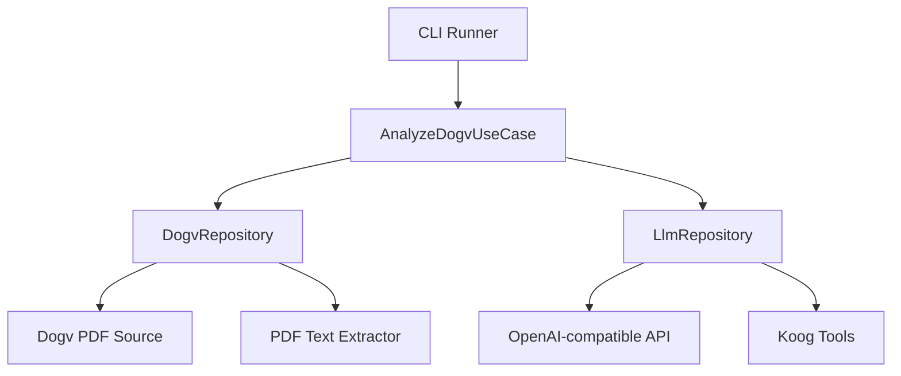

# DOGV AI Opportunity Agent (Kotlin/JVM + Koog)

Agent that scans the daily **Diari Oficial de la Generalitat Valenciana (DOGV)**, extracts the PDF bulletin, and uses an OpenAI-compatible LLM to surface AI/IT consulting opportunities with structured JSON output.

## Problem Solved
Public bulletins are dense and time-consuming. This agent automates discovery for AI/IT consultants by:
- Finding the latest DOGV PDF
- Extracting text
- Classifying and scoring opportunities
- Returning clean JSON with sources

## Architecture (Clean Architecture + Koog-inspired tools)



## Modules
- `domain`: Pure Kotlin domain models + use cases
- `data`: Koog tools, HTTP/PDF extraction, OpenAI client
- `app`: CLI entrypoint

## Setup

```bash
./gradlew :app:run --args="-l es -m 15"
```

### Environment
- `OPENAI_API_KEY` (required)
- Optional: `OPENAI_BASE_URL` (default `https://api.openai.com/v1`)
- Optional: `OPENAI_MODEL` (default `gpt-4o-mini`)
- Optional: `DOGV_TRUSTSTORE_PATH` (custom Java truststore for HTTPS)
- Optional: `DOGV_TRUSTSTORE_PASSWORD` (password for the truststore, if set)

## Docker

```bash
docker build -t dogv-agent .
docker run --rm -e OPENAI_API_KEY=sk-xxx dogv-agent
```

## docker-compose (local LLM mock)

```bash
docker compose up --build
```

## Demo
Demo placeholder removed to keep repository text-only.

## Learnings
- Kotlin/JVM keeps domain logic simple and fast to iterate.
- Koog tool abstractions make it easy to add new sources.

## CI
GitHub Actions runs ktlint, tests, and builds a Docker image on PRs.
